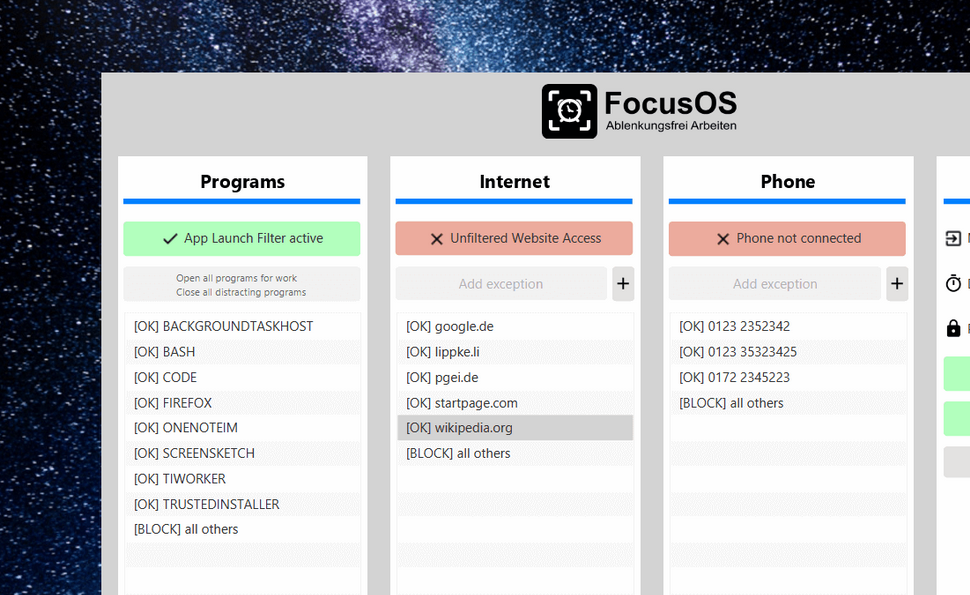
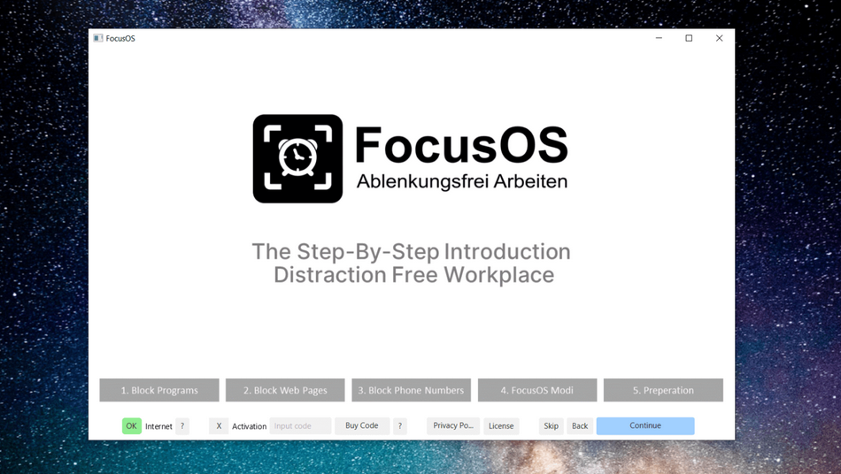
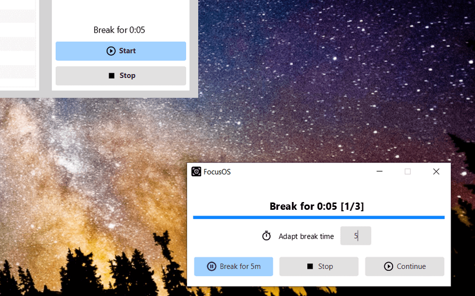

<h1 align="center"></h1>

# FocusOS Blocker for distracting Websites, Apps, Calls
   

<table>
<tr>
<td>
FocusOS converts your Windows desktop and Android phone in a distraction free workplace
</td>
</tr>
</table>

- blocks your distracting web pages
- shuts down distracting programs
- blocks all phone numbers beside your whitelist
- provides the UNBREAKABLE Focus Mode to finish your project

Get more details at: [https://lippke.li/focusos-download-english/](https://lippke.li/focusos-download-english/)

## Compatible with

- [Download Windows](https://s.pgei.de/focusosnewdownload) - full integration
- [Downlaod Ubuntu / Debian](https://s.pgei.de/focusosnewdownloaddeb) - packed in deb file
- [Download other Linux](https://s.pgei.de/focusosnewdownloadjar) - run via jar (java -jar focuso.jar)
- [Download Android](https://s.pgei.de/playocus) - Connect your app to the desktop version 

## Screenshots
### Block software, web pages, calls

## Step by Step introduction

## Autostart for focused work

## Step by Step Tutorial

1. Download the latest .exe file of FocusOS
2. Start FocusOS
3. Click on the link "More Info" in the Windows notification
4. Clock on the button "Run Anyway" on the dialog
5. Inform about the features in the intro slide show of FocusOS
6. Start windows programs you need for the session and close all program you do not need
7. Choose all the web pages for the whitelist and block pages you do not need (e. g. Social media)
8. Add telephone numbers for the whitelist
9. Download FocusOS App for [Google Play](https://s.pgei.de/playocus)
10. Type in the activation code in the phone
11. Start the session on your desktop app + phone app

Image Source: <a href="https://www.freepik.com/psd/background">Background psd created by rawpixel.com – www.freepik.com</a>
